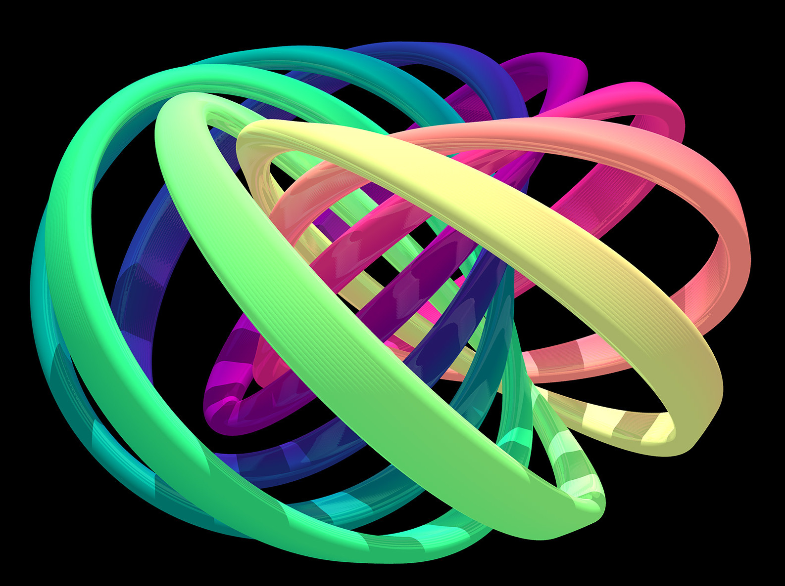

I am physics graduate with PhD in condensed matter physics. In my PhD, I studied a <a href="https://journals.aps.org/prl/abstract/10.1103/PhysRevLett.126.136601" target="_blank">Model Hamiltonian</a> which describes aspects of Fractional Quantum Hall effect. Other problems I worked on are listed in the Reseach tab above. 

<figure style="float: center; text-align: center; margin: 10px;">
  
  <figcaption>Courtesy: David S. Hall, Amherst College, using code developed by Niles Johnson</figcaption>
</figure>

Currently, I'm teaching undergraduate physics at <a href="https://www.jlngcharipurmanali.ac.in/" target="_blank">JLNGC, Haripur.</a> This webpage contains a record of my research, teaching resources and some blog posts related to physics and physics teaching in general.